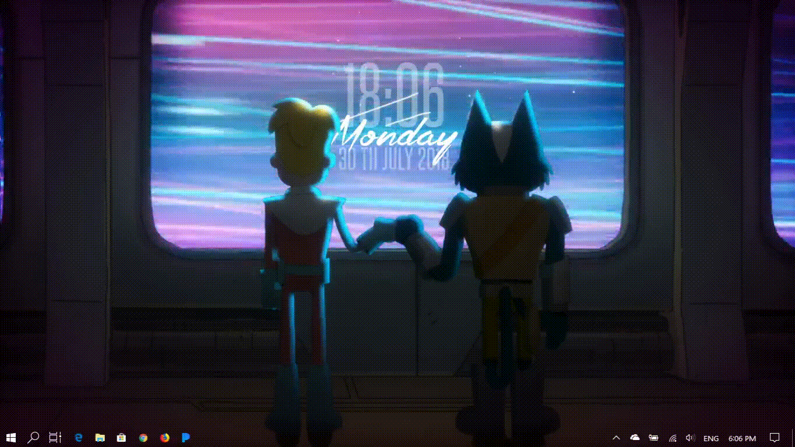
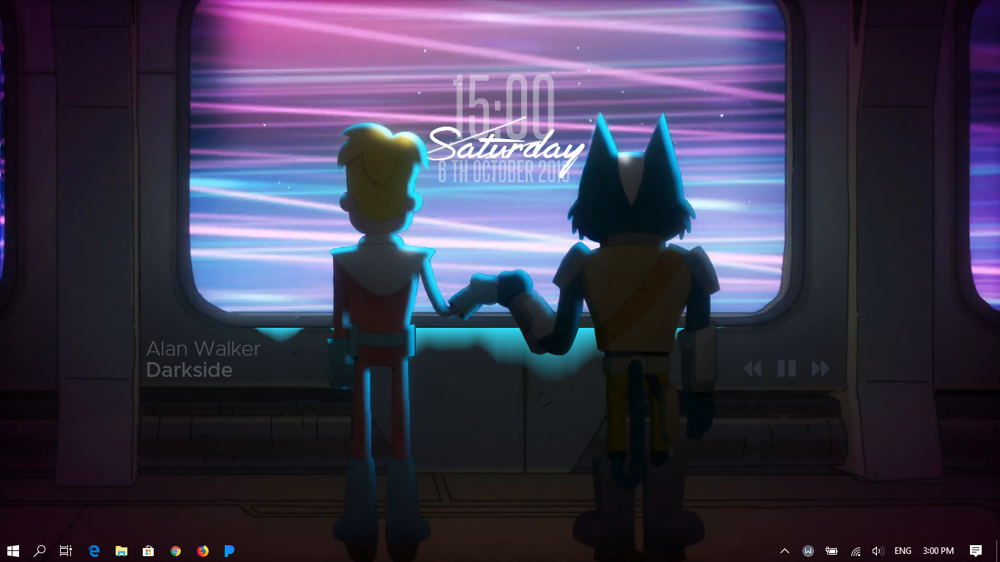

# Final Space Rainmeter Skin
**Demo**

**Screenshot**

# Install Instructions
- Download [FinalSpace_1.0.0.rmskin](https://github.com/Mibo5354/FinalSpace/raw/master/FinalSpace_1.0.0.rmskin)
- Download and install [Rainmeter](https://www.rainmeter.net)
- Open .rmskin and install
- Load included layout or customise it yourself
- Layout only includes the what is shown on the demo.gif and not the screenshot
# Credits
- Clock - La Compagnie des Ombres Clock by [MadMilov2](https://www.deviantart.com/madmilov2/art/La-Compagnie-des-Ombres-486976404)
- Music Visualiser - Monstercat Visualizer by [MarcoPixel](https://www.deviantart.com/marcopixel/art/Monstercat-Visualizer-for-Rainmeter-486330771)
- Song Information - Cleartext by [Redsaph](https://www.deviantart.com/redsaph/art/Cleartext-for-Rainmeter-v5-1-1-28-Jul-2018-519796161)
- Music Controls - Simple Media by [Eldog-02](https://www.deviantart.com/eldog-02/art/Simple-Media-4-708899608)
- Background sourced from Final Space S01E06
- Toggle and Animated Background by Mibo5354
- Toggle switches between Static, Animated, and the Music mode.
